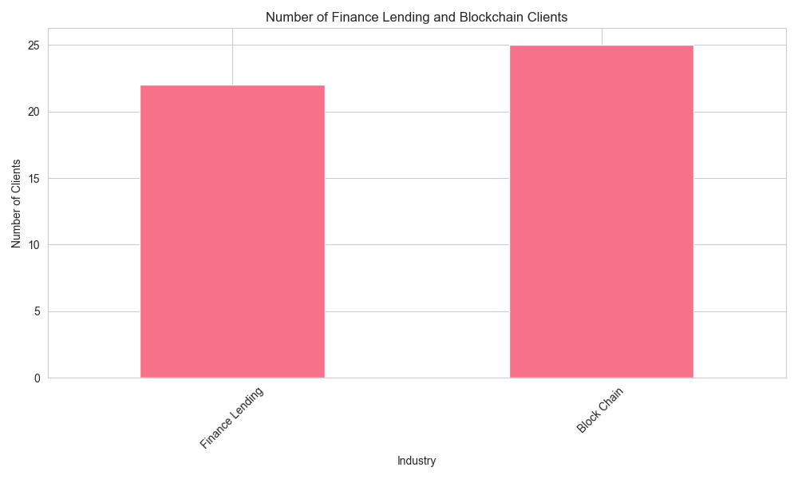
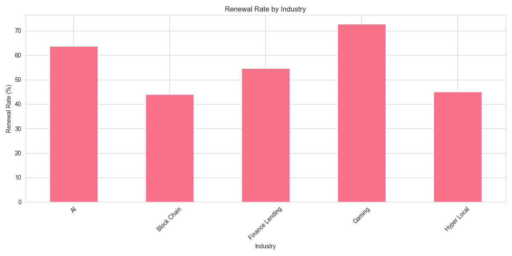
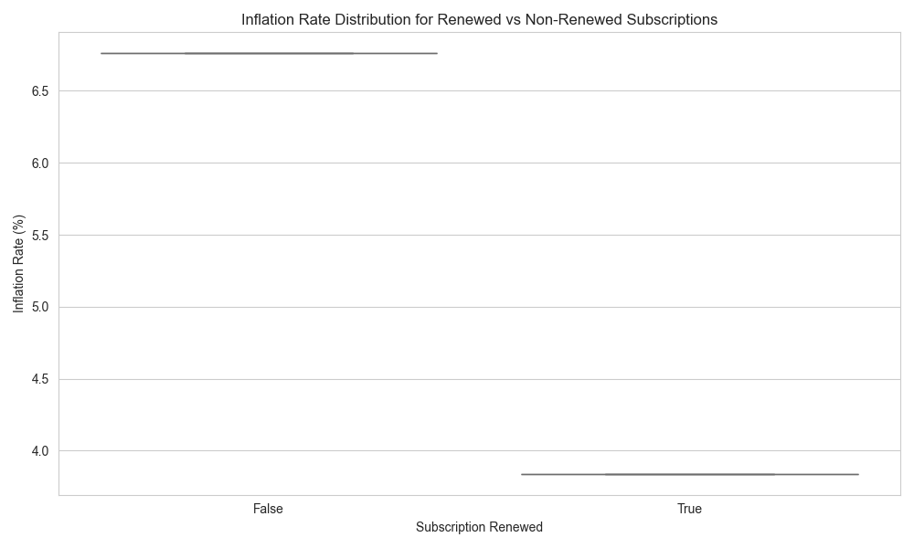
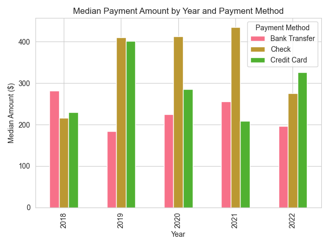

# Financial and Subscription Analysis

This project analyzes client data across different industries, focusing on subscription renewals, payment patterns, and the impact of economic factors.

## Analysis Results

### 1. Industry Distribution

**Key Findings:**
- Finance Lending: 22 clients
- Block Chain: 25 clients

**Analysis:** The relatively even distribution between Finance Lending and Blockchain sectors suggests a balanced portfolio strategy in these emerging technology sectors.

### 2. Renewal Rates by Industry

**Key Findings:**
- Gaming: 72.73%
- AI: 63.64%
- Finance Lending: 54.55%
- Hyper Local: 45.00%
- Block Chain: 44.00%

**Analysis:** Gaming and AI industries show significantly higher renewal rates, likely due to:
- Gaming sector's stable revenue models and established market presence
- AI's growing importance and business value proposition
- Lower renewal rates in Blockchain might indicate market volatility or product-market fit challenges

### 3. Inflation Impact on Renewals

**Key Findings:**
- Average inflation rate during renewals: 3.84%

**Analysis:** The moderate inflation rate during renewals suggests that pricing adjustments have been reasonable enough to maintain client relationships while accounting for economic conditions.

### 4. Payment Trends (2018-2022)

**Key Findings:**
Median Payment Amounts by Year and Method: 